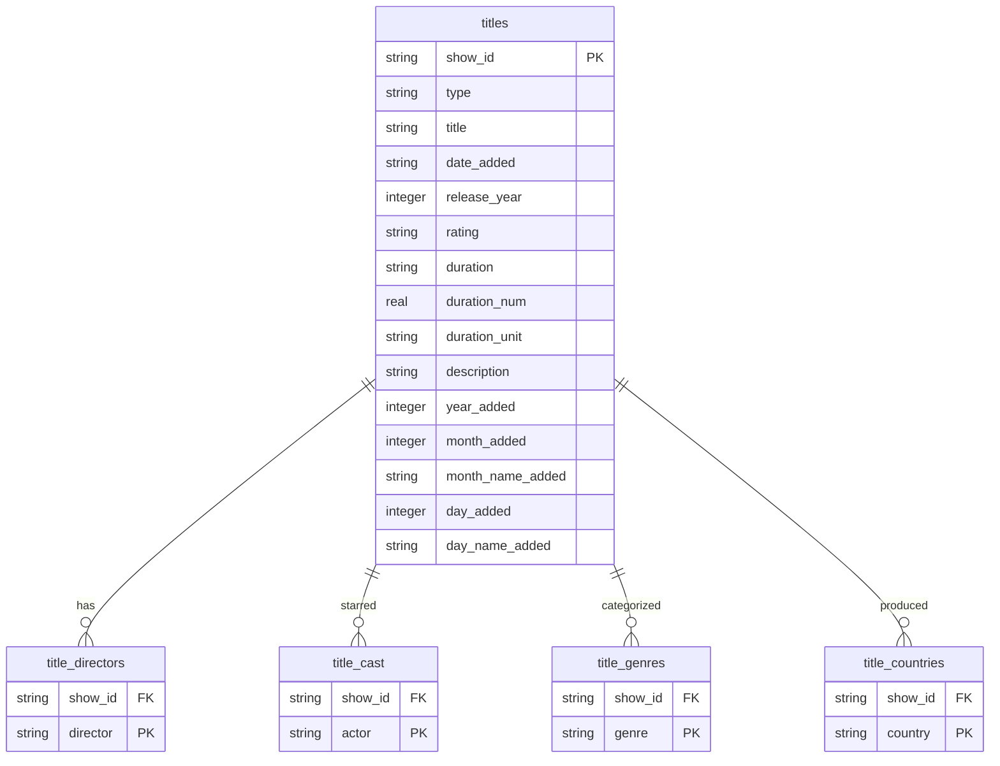

# Netflix Catalog Optimization & Content Strategy Project

Welcome to the **Netflix Catalog Optimization & Content Strategy** data analytics project. This repository contains the complete end-to-end data pipeline, statistical modelling, relational database normalization, and interactive business reporting designed to help Netflix optimize its capital efficiency and subscriber retention.

---

## 📈 Executive Summary
Netflix operates in a saturated and highly competitive streaming landscape. Content decisions require substantial financial commitments. 

This project analyzes the Netflix catalog (7,787 titles) to evaluate the balance between Movies and TV Shows, identify top regional production hubs, analyze genre distributions, and map seasonal release trends.

### Key Visualizations & Artifacts
The analysis code generates several high-resolution visual plots, which are saved in the `images/` directory:
1.  **movies_vs_tvshows.png**: The proportion of Movies (69.1%) to TV Shows (30.9%) in the catalog.
2.  **content_added_over_time.png**: The growth curve of Netflix additions from 2008 to 2021, showcasing the peak in 2019 and the pandemic impact in 2020.
3.  **top_countries.png**: Sourcing volume by country, highlighting the dominance of the United States and India.
4.  **rating_distribution.png**: Catalog distribution by age group, indicating a focus on TV-MA (36.8%) and TV-14 (24.8%).
5.  **movie_duration_distribution.png**: Movie lengths centered around 90–100 minutes.
6.  **tv_show_seasons_distribution.png**: The cancellation slope showing that 66.8% of TV Shows are discontinued after Season 1.
7.  **duration_boxplot.png**: Outlier visualization of film lengths.
8.  **top_genres.png**: Ranking of categories with International Movies and Dramas leading.
9.  **monthly_seasonal_trends.png**: Schedulers' spikes in November and December.

---

## 🛠️ Project Structure
```
├── netflix_titles.csv            # Original raw dataset
├── netflix_titles_cleaned.csv    # Cleaned and feature-engineered dataset
├── netflix.db                    # SQLite database with normalized schema
├── download_data.py              # Download script for raw dataset
├── check_packages.py             # Script to verify Python dependencies
├── analyze_netflix.py            # Main cleaning, stats, and visualization pipeline
├── normalize_db.py              # Relational database normalizer and SQL runner
├── copy_assets.py                # Asset copy script for reports
├── sql_results.txt               # Executed SQL queries and actual results
├── images/                       # Folder containing generated plots
└── README.md                     # This documentation
```

---

## 🗄️ Relational Database Schema (3NF-like)
To avoid handling comma-separated strings in SQL, `normalize_db.py` splits multi-valued fields into normalized tables:



---

## ⚙️ How to Run the Analysis

### 1. Prerequisites
Ensure you have Python 3.x installed. Install the required analytical libraries:
```bash
pip install pandas numpy matplotlib seaborn openpyxl
```

### 2. Run Python Data Analysis & Visualizations
Execute the main script to clean the raw dataset, compute descriptive statistics, detect outliers, and generate visual charts in the `images/` directory:
```bash
python analyze_netflix.py
```

### 3. Normalize Schema & Run SQL Queries
Create the SQLite database `netflix.db` and execute the optimized queries by running:
```bash
python normalize_db.py
```
This generates `sql_results.txt` containing the actual query results, including Year-over-Year Growth, Top Cast, Top Genres, and Actor-Director collaborations.

---

## 📊 Key Business Metrics (Calculated)
*   **Total Cleaned Titles:** 7,777
*   **Total Movies:** 5,377 (69.1%)
*   **Total TV Shows:** 2,400 (30.9%)
*   **Average Movie Duration:** 99.3 minutes (Median: 98 minutes, Mode: 90 minutes)
*   **Average TV Show Length:** 1.76 Seasons (Median: 1 Season, Mode: 1 Season)
*   **TV Show Cancellation Rate:** **66.8%** of all shows are discontinued after Season 1.
*   **Maturity Focus:** Mature (TV-MA) and Teen (TV-14) content represent **61.5%** of the catalog.
*   **Year-over-Year Peak:** 2019 with **2,153 additions** (+27.77% growth).

---

## 💡 Top Strategic Insights & Recommendations
1.  **Address TV Show Churn:** With 66.8% of shows cancelled after Season 1, Netflix should reallocate a portion of the catalog acquisition budget to support successful existing series and build longer-term viewer engagement.
2.  **Capture the Family Segment:** Less than 3% of the catalog is rated G or TV-G. Expanding family-friendly content will help Netflix compete with Disney+ for household subscriptions.
3.  **Optimize Release Scheduling:** Smooth out the content release calendar. Launching major titles in May and August will help keep subscribers engaged during historically slow quarters.
4.  **Strengthen Creative Partnerships:** Leverage actor-director collaboration insights (e.g., S.S. Rajamouli and Prabhas in India) to sign multi-project deals, securing successful talent combinations for regional originals.
